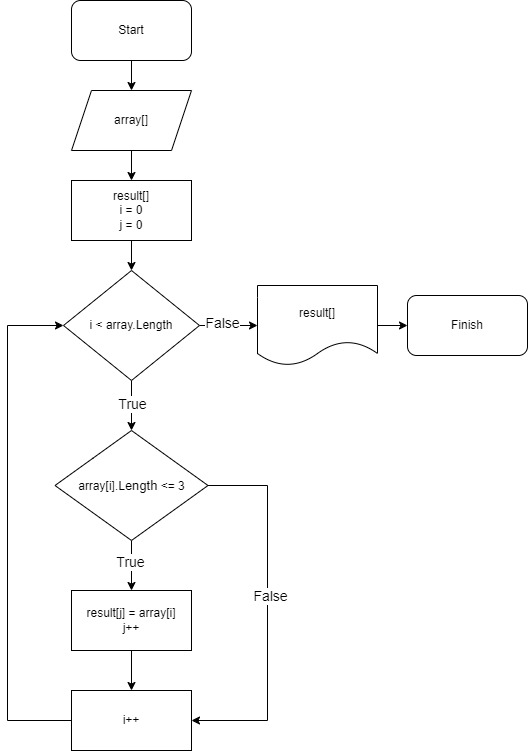

# Итоговая работа первой четверти
1. Создать репозиторий на GitHub
2. Нарисовать блок-схему алгоритма (можно обойтись блок-схемой основной содержательной части, если вы выделяете её в отдельный метод)
3. Снабдить репозиторий оформленным текстовым описанием решения (файл README.md)
4. Написать программу, решающую поставленную задачу
5. Использовать контроль версий в работе над этим небольшим проектом (не должно быть так, что всё залито одним коммитом, как минимум этапы 2, 3, и 4 должны быть расположены в разных коммитах)

## **Задача** 

Написать программу, которая из имеющегося массива строк формирует новый массив из строк, длина которых меньше, либо равна 3 символам. Первоначальный массив можно ввести с клавиатуры, либо задать на старте выполнения алгоритма. При решении не рекомендуется пользоваться коллекциями, лучше обойтись исключительно массивами.

### **Примеры:**

[“Hello”, “2”, “world”, “:-)”] → [“2”, “:-)”]

[“1234”, “1567”, “-2”, “computer science”] → [“-2”]

[“Russia”, “Denmark”, “Kazan”] → []

## **Решение**

### Блок - схема решения



### Код
```csharp
    
string[] CreateArray() // создание массива
{
    System.Console.Write("Через пробел вводите данные: ");
    string[] array = Console.ReadLine()!.Split();
    return array;
}

void PrintArray(string[] array) // вывод массива на экран
{
    System.Console.Write("[");
    for (int i = 0; i < array.Length; i++)
    {
        if (i < array.Length - 1) System.Console.Write(array[i] + "," + " ");
        else System.Console.Write(array[i]);
    }
    System.Console.WriteLine(']');
}

int LengthNewArray(string[] array) // кол-во эл-ов массива, отвечающих условию
{
    int count = 0;
    for (int i = 0; i < array.Length; i++)
    {
        if (array[i].Length <= 3) count++;
    }
    return count;
}

string[] CreateNewArray(string[] array, string[] result) // заполнение нового массива
{
    int j = 0;
    for (int i = 0; i < array.Length; i++)
    {
        if (array[i].Length <= 3)
        {
            result[j] = array[i];
            j++;
        }
    }
    return result;
}

string[] array = CreateArray();
string[] result = new string[LengthNewArray(array)];
result = CreateNewArray(array, result);
PrintArray(result);
